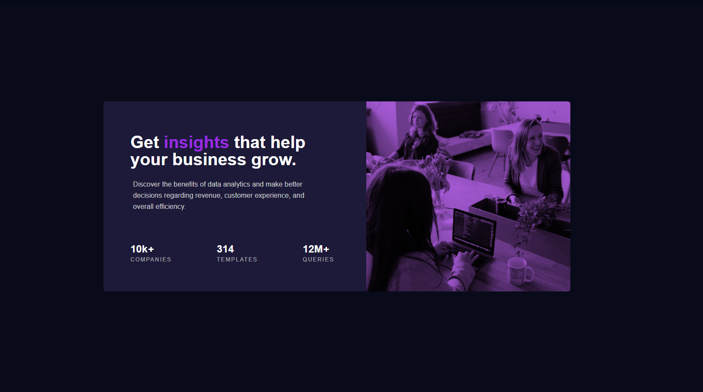

# 📊 Stats Preview Card

A clean and responsive stats preview card component built with HTML and CSS. This project focuses on creating a modern split-card layout that presents business analytics metrics with a vibrant color overlay and responsive typography.

## ✨ What this project does

This project demonstrates:

- responsive split-card layout design
- CSS image blending with `background-blend-mode: multiply`
- clean stat typography and metric highlights
- media query breakpoints for seamless mobile viewports
- modern color composition with custom HSL palettes

## 🎯 Purpose

This card layout is inspired by modern SaaS and business analytics landing pages. It serves as a practical exercise for mastering flexbox alignment, container sizing, color contrast, and image overlay techniques in CSS.

## 📊 Key Metrics Displayed

- 🏢 **10k+** companies using the platform
- 📄 **314** customizable templates
- ⚡ **12M+** queries processed

## 🖼️ Screenshots

  

## 💡 What I Learned

- how to combine `background-color`, `background-image`, and `background-blend-mode: multiply` to create a vivid purple image tint
- how to use Flexbox `flex-direction: column-reverse` on mobile viewports to reposition the header image above the text content
- how to fine-tune `letter-spacing` and `text-transform` for clean uppercase section labels

## ▶️ How to run

1. Open the project folder in VS Code.
2. Open [Stats_Preview/index.html](index.html).
3. Preview it with Live Server or open the file directly in your browser.

## 🛠️ Technologies used

- HTML5
- CSS3 (Flexbox, Media Queries, Background Blend Modes)
- Google Fonts (Poppins)

## 📁 Project structure

- `index.html` — structural HTML markup and card layout
- `style.css` — visual styling, HSL color palette, and media queries
- `images/` — image assets (desktop and mobile header graphics, favicon)
- `design/` — reference design mockups for desktop and mobile

## 🚀 Future ideas

You can enhance this project by adding:

- animated count-up effects for the numbers using JavaScript
- dark/light mode toggle
- interactive hover tooltips on stat blocks

## 👨‍💻 Author

Built by **Liam Araya** ([@liamwork999-art](https://github.com/liamwork999-art)) as a front-end UI practice project.
